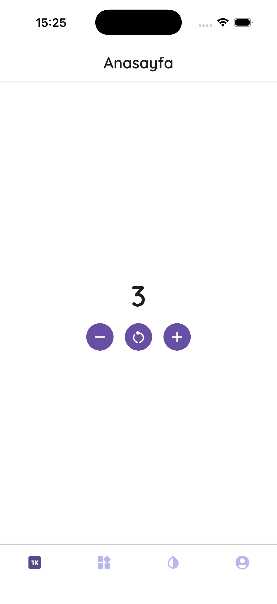
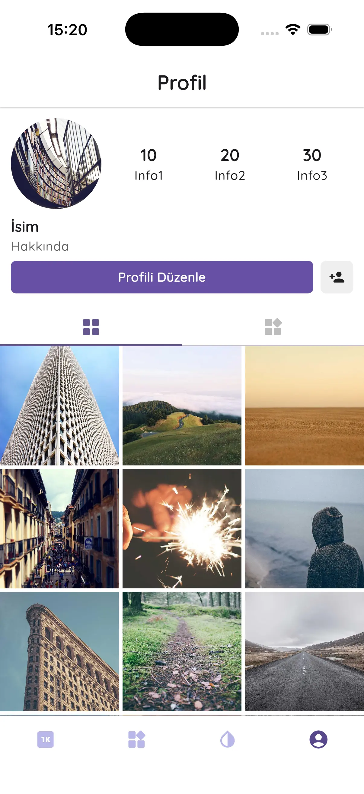
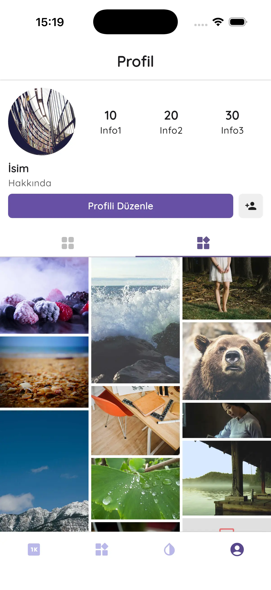
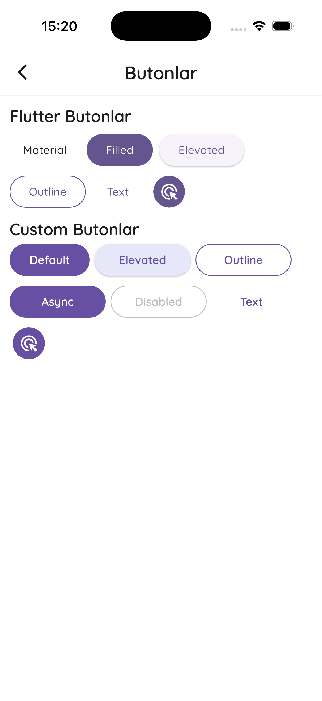
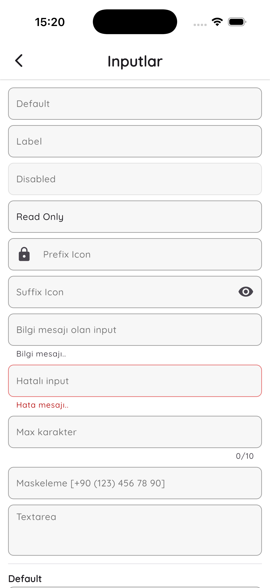
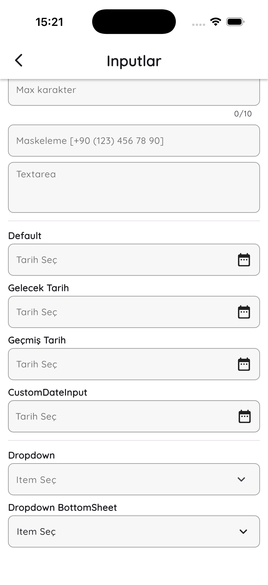
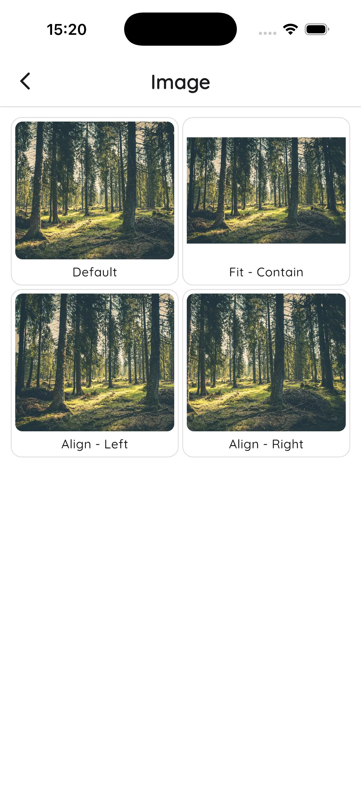
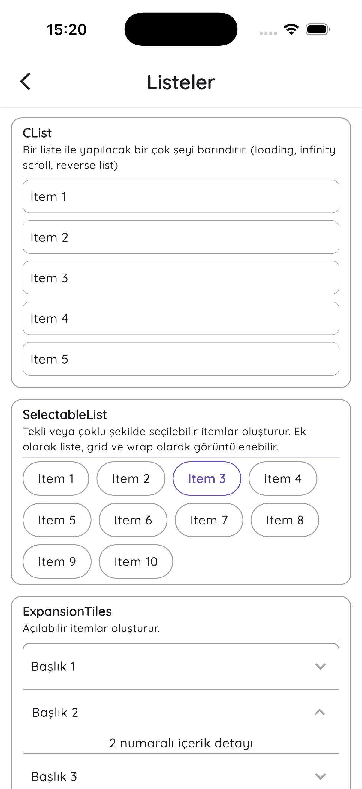
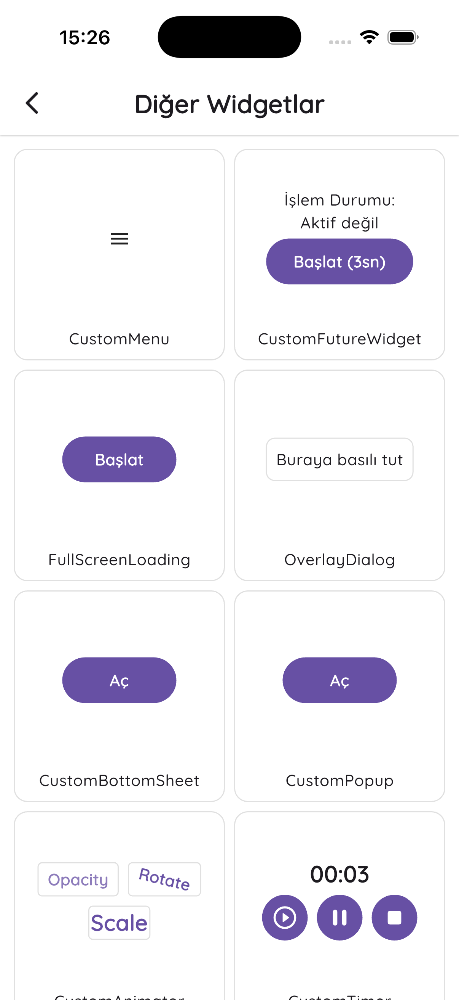
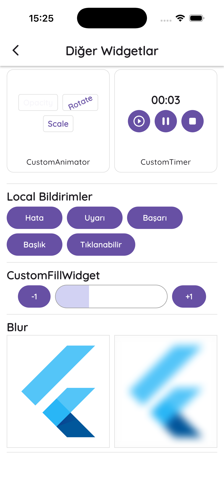

# **StarterKit Flutter**

Flutter projeleri için hızlı başlangıç sağlayan, düzenli yapı ve yeniden kullanılabilir bileşenler içeren bir başlangıç kiti.

Bu proje, **Feature-Based (Özellik Odaklı)** yapı ile birlikte **MVVM (Model-View-ViewModel)** mimarisi kullanılarak geliştirilmiştir. Bu sayede ölçeklenebilir, sürdürülebilir ve modüler bir yapı sunar.

📦 **Kurulum ve Kullanım**
  - Bu repodaki **lib** klasörünü kendi projenizin **lib** klasörü ile değiştirin.
  - İhtiyacınıza göre, kullanmayacağınız klasörleri, örnek feature’ları, demo ekranları kaldırabilirsiniz.

⚠️ **Dikkat Edilmesi Gerekenler**
  - Gerekli bağımlılıklar (packages) yüklü değilse proje hata verebilir.
  - [hive.dart](starterkit/lib/services/storage/hive.dart) dosyasında bulunan **'_boxName'** değişkenini projenize uygun şekilde güncellemeniz gerekmektedir.

#

### Kullanılan kütüphaneler:

<table>
  <tr valign="top">
    <td>
      <ul>
        <li>API Service</li>
        <ul>
          <li>dio</li>
        </ul>
        <li>Cache</li>
        <ul>
          <li>hive</li>
          <li>hive_flutter</li>
        </ul>
        <li>Widgets</li>
        <ul>
          <li>animator</li>
          <li>another_flushbar</li>
          <li>cached_network_image</li>
        </ul>
      </ul>
    </td>
    <td>
      <ul>
        <li>Other</li>
        <ul>
          <li>intl</li>
          <li>mask_text_input_formatter</li>
          <li>auto_size_text</li>
          <li>flutter_svg</li>
          <li>animated_bottom_navigation_bar</li>
        </ul>
      </ul>
    </td>
  </tr>
</table>

 

# Mimari

### Klasör Yapısı

Proje, kodun okunabilirliğini ve tekrar kullanılabilirliğini artırmak adına belirli sorumluluk alanlarına bölünmüştür:

- [services](starterkit/lib/services): Projeden tamamen bağımsız, genel amaçlı servisleri içerir. Bu katman, farklı projelere doğrudan taşınabilecek (plug-and-play) şekilde tasarlanmıştır (örn: API istemcileri, Firebase servisleri vb.).
  Bu yapıyı projeye eklemek için ihtiyacınız olan servisleri, [flutter-services](https://github.com/cihatyalman/flutter-services) reposundan seçip doğrudan projenize dahil edebilirsiniz.

- [features](starterkit/lib/features): Uygulamanın kalbi burasıdır. Her bir özellik (Login, Home vb.) kendi MVVM katmanlarıyla burada inşa edilir ve yönetilir. Bu sayede özellik bazlı geliştirme ve hata ayıklama kolaylaşır.

- [screens](starterkit/lib/screens): Features içinde hazırlanan mantık ve arayüz parçalarının birleştirildiği katmandır. Uygulamanın navigasyon yapısındaki tüm ana sayfalar burada konumlanır.

- [widgets/custom](starterkit/lib/widgets/custom): Projeden bağımsız, her projede kullanılabilecek genel widget'lar (Örn: CustomButton, CustomInput).

- [widgets/project](starterkit/lib/widgets/project): Sadece bu projeye özgü tasarım dilini ve mantığını yansıtan widget'lar.

- [utils](starterkit/lib/utils): Proje genelinde kullanılan yardımcı (helper) fonksiyonları, extension'ları ve validator'ları içerir.

- [shared](starterkit/lib/shared): Tüm uygulama genelinde paylaşılan kaynakların merkezidir. Proje sabitleri (constants), ortak veri modelleri burada yer alır.

### Feature-Based Architecture

Projeyi teknik katmanlar yerine sunduğu özelliklere (Giriş, Profil, Sepet vb.) göre parçalara ayırırız.

- **Modülerlik:** Yeni bir özellik eklerken veya var olanı silerken tüm proje içinde gezmeniz gerekmez; her şey kendi klasörü altındadır.

- **Düzen ve Çakışma Önleme:** Farklı ekiplerin aynı dosya üzerinde çalışma ihtimalini minimize ederek kod çakışmalarını (conflict) engeller.

### MVVM Mimari Katmanları

Özellikleri kendi içinde sorumluluklarına göre katmanlara ayırarak UI ve iş mantığını (logic) birbirinden tamamen ayırıyoruz:

- **View:** Sadece arayüzün (UI) oluşturulduğu katmandır. Hiçbir iş mantığı içermez.

- **ViewModel:** UI'ın "beyni"dir. Veriyi View için hazırlar ve arayüzdeki kullanıcı hareketlerini yönetir.

- **Repository:** Verinin nereden (API, Yerel Veri Tabanı vb.) geleceğine karar veren yönetim merkezidir.

- **Store:** Ham verinin depolandığı katmandır.

- **Model:** Veri şablonlarını ve tip dönüşümlerini (JSON serialization) tanımlar.

**Neden bu yapı?**  
Bu soyutlama sayesinde, örneğin veri kaynağınızı değiştirmek istediğinizde sadece Repository katmanını güncellersiniz; arayüzünüz (View) bundan etkilenmez. Aynı şekilde, aynı iş mantığını kullanarak sadece View katmanını değiştirip projenizi mobil platformdan web platformuna kolayca taşıyabilirsiniz.

 

# Flutter Snippet

Geliştirme sürecini hızlandırmak ve mimariye uygun kod bloklarını anında oluşturmak için hazırladığım [kod parçalarına](flutter.code-snippets) buradan ulaşabilirsiniz.

 

# Demo İçerikleri

- [counter](starterkit/lib/features/counter): Klasik counter uygulamasının MVVM prensiplerine göre yeniden yorumlanmış halidir. Verinin katmanlar arasındaki akışını ve durum yönetiminin (state management) mimariye nasıl entegre edildiğini bu örnekte inceleyebilirsiniz.
   
  

- [profile](starterkit/lib/features/profile): Instagram profil sayfasının sadeleştirilmiş bir klonudur.
   
  

    
    
  

- [widget](starterkit/lib/features/widget): Proje içerisinde yer alan custom ve project seviyesindeki widget'ların kullanım örneklerini içerir. Kendi bileşenlerinizi oluştururken referans alabileceğiniz bir rehber niteliğindedir.
   
  

    
    
    
    
    
    
    
  

